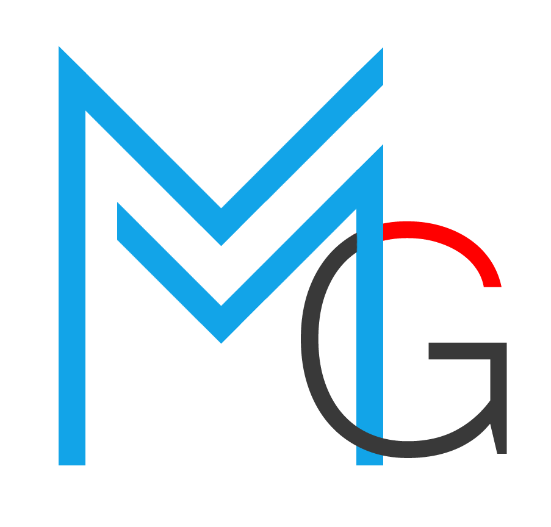

<p align="center"></p>

# MMG Healthcare CRM

A professional Healthcare Distribution CRM built with **Laravel 12**, **Filament 4**, and **Spatie Permission**. This system is designed to streamline healthcare product distribution, track sales performance, and manage customer relationships across the Java region.

## 🚀 Key Features

### 📊 Comprehensive Dashboard
- **Sales Performance**: Real-time tracking of Total Net Sales, Average Order Value (AOV), and Overdue Revenue.
- **CRM Analytics**: Visibility into Total Customers, Pipeline Value, and Stale Lead detection.
- **Lead Pipeline**: Funnel visualization showing Won, Lost, and In-Progress opportunities.

### 🏥 CRM & Lead Management
- **Healthcare Facilities**: Categorized management of Hospitals, Clinics, Pharmacies, and Labs with tiered classification (Tier 1-3).
- **Activity Tracking**: Full audit trail of every interaction (Calls, Meetings, Demos) performed by Sales Representatives.
- **Lead Lifecycle**: Track prospects from initial contact to conversion, including automated "Last Contact" tracking based on activities.

### 🛒 Sales & Distribution
- **Order Management**: Streamlined order tracking with automated IDR currency formatting and status-based badge systems.
- **Regional Hierarchy**: Geographic organization focusing on the Java region (6 provinces) with city-level granularity.
- **Distribution Partners**: Track orders through various distributors and principals.

### 📦 Product & Inventory
- **Master Data**: Manage Principals, Segments (Pharma, Med-Equip), and Sub-segments.
- **Inventory Tracking**: Stock level monitoring with automated color-coded warnings for low-stock items.

### 🛡️ Security & Organization
- **RBAC**: Robust Role-Based Access Control using Spatie Permission (Super Admin, Head, RSM, ASM, SPV, SR).
- **Reporting Hierarchy**: Built-in organizational structure tracking reporting lines from Sales Reps up to the Head of Department.

## 🛠 Tech Stack
- **Framework**: Laravel 12
- **Admin Panel**: Filament 4 (using modular Schemas/Tables architecture)
- **Database**: MariaDB
- **Authentication**: Spatie Laravel-Permission
- **Styling**: Tailwind CSS & Heroicons

## 🚦 Getting Started

1. **Install Dependencies**:
   ```bash
   composer install
   npm install && npm run build
   ```

2. **Environment Setup**:
   ```bash
   cp .env.example .env
   php artisan key:generate
   ```

3. **Database Migration & Seeding**:
   ```bash
   # Fresh migrate and seed with realistic sample data
   php artisan migrate:fresh --seed
   ```

4. **Import Regional Data**:
   ```bash
   # Fetch provinces and cities from Wilayah.id
   php artisan territories:import java
   ```

## ⚖️ License
The MMG Healthcare CRM is open-sourced software licensed under the [MIT license](https://opensource.org/licenses/MIT).